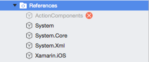
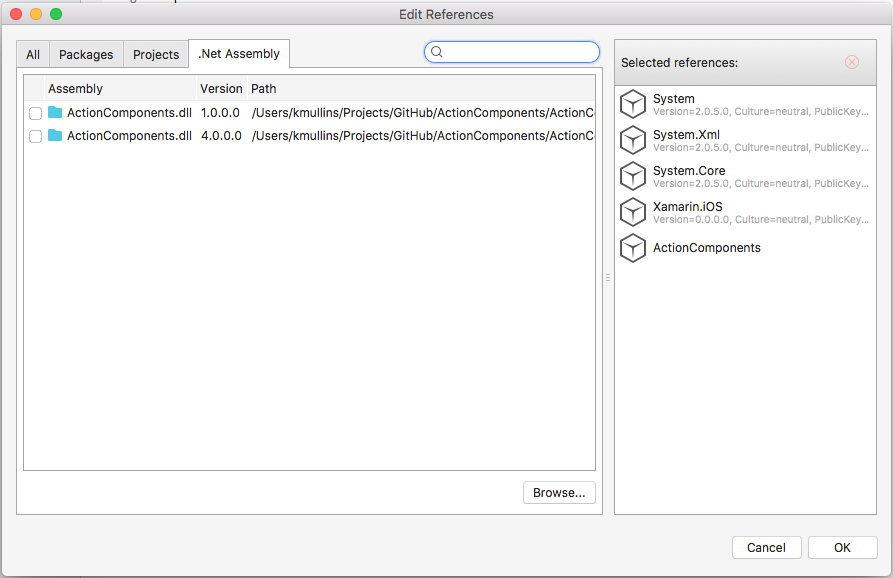

# About Action View

**Action View** is a collection of custom view controls and helper methods for iOS and Android that take the grunt work out of common user interface tasks. Create stunning experiences with easy by using **Action Views** directly or use them as the basis of your own custom controls. If fact, **Action Views** form the basis of our other tools in the Action Components suite.

# Running the Samples

Before you can successfully build and run these sample apps, you'll need to download and install the [Action Components Trail](http://appracatappra.com/products/action-components/) version from the Appracatappra website or have purchased and installed a licensed version of the components.

Next, open either the iOS or the Android version of the sample in Visual Studio and expand the **Resources** folder:

If the `ActionComponents` entry is grayed-out with a red X (as shown in the image above), right-click on it and select **Delete**. Double-Click the **Resources** folder to open the **Edit References** dialog and select the **.Net Assembly** tab:

Click the **Browse** button, navigate to where you installed the **Action Components** trial or licensed version and locate the appropriate `ActionComponents.ddl` (for either iOS or Android) and click the **OK** button. The sample will now be ready to run.

# Reduce Repetitive Code

Creating immersive, captivating mobile user interfaces usually means writing similar, repetitive code for common interface tasks. At Appracatappra we say, “Why reinvent the wheel?” That’s why we created our Action View low-level tool suite. They encapsulate the logic to handle common tasks such as tapping, moving, rotating and dragging so you can focus on making your mobile app great and not the details of implementation.

# Action View Elements

The Action View low-level tool suite is composed of the following time-saving elements:

## ACImage

This static class contains several helper functions for working with `UIImages` including the ability to detect an iPhone 5 (or greater) images in the form `name-568@2x.ext` and automatically load them in the place of `name.ext` or `name@2x.ext` files and helper routines for easily dealing with rotation.

`ACImage` iOS Features:

* **FromFile** – Returns a `UIImage` specified by the given filename in the form name.ext. If running on a retina based device and a file in the form `name@2x.ext` exists in the same path, it will be loaded instead. If running on an iPhone 5 (or greater) and a file in the form `name-568@2x.ext` exists, it loads automatically.
* **DegreesToRadians** – Converts the given degrees to radians.
* **RotateImage** – Rotates the given UIImage to the given degrees.

`ACImage` Android Features:

* **FromFile** – Returns a `Bitmap` for the image specified by the given filename and optional adjusts its width and/or height.
* **ImageInfoFromFile** – Returns information about the image with the given filename without loading the image into memory.
* **FromResource** – Returns a `Bitmap` for the image specified by the given resource ID and optional adjusts its width and/or height.
* **ImageInfoFromResource** – Returns information about the image with the given resource ID without loading the image into memory.
* **CalculateInSampleSize** – Calculates the sampling factor for an image being loaded into memory and down-sampled at the same time.
* **RotateImage** – Rotates the given image `Bitmap` about it center axis to the given degrees.

## ACImageView

Is a custom `UIImageView` that contains many useful built-in features such as being draggable with optional constraints for it’s X and Y axis, user interaction events such as touched, moved and released, and provides methods to make moving, rotating and resizing easier and with less code.

`ACImageView` iOS features:

* **draggable** – If true this **Action View** can be dragged around the screen by the user. Optional `ACViewDragContraints` can be applied to the X and/or Y axis to automatically limit movement to none, locked, or constrained to a minimum and maximum value.
* **bringToFrontOnTouched** – if true this **Action View** will automatically become the top `UIView` when touched by the user.
* **Custom Constructors** – Featuring shortcuts such as creating an `ACImageView` from an image file or placing it at a given X/Y position quickly.
* **FromFile** – Loads the `ACImageView` with the image file specified using `ACImage` (with all of it’s features). If this `ACImageView` already contained an image, this routine ensures that all memory used by that image is released first.
* **DisposeImage** – Releases any memory used by a `UIImage` attached to this ACImag`eView.
* **MoveToPoint** – Moves this **Action View** to the given point.
* **Resize** – Changes the size of this **Action View** to the given size.
* **RotateTo** – Rotates this **Action View** to the given degrees.
* **RotateImageTo** – Rotates the `UIImage` contained in this `ACImageView` to the given degrees.
* **PointInside** – Tests to see if the given point is inside this **Action View‘s** Frame.
* **Purge** – Forces this **Action View** to release all memory contained within it and recursively any subviews attached to it.
* **User Interaction Events** – Respond to touched, moved, or released events to provide user interaction with this **Action View**.

`ACImageView` Android features are the same as iOS with the exception of:

* **TopMargin**, **BottomMargin**, **LeftMargin**, **RightMargin**, **LayoutWidth**, **LayoutHeight** – Helper properties for working with the Android layout the `ACImageView` is hosted in.
* **FromBitmap** – Loads the `ACImageView` with the given `Bitmap` image.
* **FromResource** – Loads the `ACImageView` with the given image from the Resource ID.
* **Purge** – Is not currently supported on Android.

## ACLabel

Is a custom `UILabel` that contains events such and touched and released and helper methods to easily handle moving, rotating, and resizing.

`ACLabel` iOS features:

* **bringToFrontOnTouched** – if true this **Action View** will automatically become the top `UIView` when touched by the user.
* **MoveToPoint** – Moves this **Action View** to the given point.
* **Resize** – Changes the size of this **Action View** to the given size.
* **RotateTo** – Rotates this **Action View** to the given degrees.
* **User Interaction Events** – Respond to touched or released events to provide user interaction with this **Action View**.

`ACLabel` Android features are the same as iOS with the exception of:

* **TopMargin**, **BottomMargin**, **LeftMargin**, **RightMargin**, **LayoutWidth**, **LayoutHeight** – Helper properties for working with the Android layout the `ACLabel` is hosted in.
* **RotateTo** – Is not currently supported on Android.

## ACView

Is a custom `UIView` that contains many useful built-in features such as being draggable with optional constraints for it’s X and Y axis, user interaction events such as touched, moved and released, and provides methods to make moving, rotating and resizing easier and with less code.

`ACView` iOS features:

* **draggable** – If true this **Action View** can be dragged around the screen by the user. Optional `ACViewDragContraints` can be applied to the X and/or Y axis to automatically limit movement to none, locked, or constrained to a minimum and maximum value.
* **bringToFrontOnTouched** – if true this **Action View** will automatically become the top `UIView` when touched by the user.
* **MoveToPoint** – Moves this **Action View** to the given point.
* **Resize** – Changes the size of this **Action View** to the given size.
* **RotateTo** – Rotates this **Action View** to the given degrees.
* **PointInside** – Tests to see if the given point is inside this **Action View‘s** Frame.
* **Purge** – Forces this **Action View** to release all memory contained within it and recursively any subviews attached to it.
* **User Interaction Events** – Respond to touched, moved, or released events to provide user interaction with this **Action View**.

`ACView` Android features are the same as iOS with the exception of:

* **GetViewHeight**, **SetViewHeight**, **GetViewWidth**, **SetViewWidth**, **GetViewTopMargin**, **SetViewTopMargin**, **GetViewBottomMargin**, **SetViewBottomMargin**, **GetViewLeftMargin**, **SetViewLeftMargin**, **GetViewRightMargin**, **SetViewRightMargin** – Static helper routines for working with Android views no matter what layout they are in.
* **TopMargin**, **BottomMargin**, **LeftMargin**, **RightMargin**, **LayoutWidth**, **LayoutHeight** – Helper properties for working with the Android layout the `ACView` is hosted in.
* **RotateTo** – Is not currently supported on Android.

## ACViewController

Is an Android component for working with `Views` that have been inflated from a `.axml` file by providing a place to hold the code to handle any UI Widgets so you don’t have to put it in the Activity class that is loading the view or create a new activity to support it. Create a child of this class, override the `Initialize` method and place the code to handle your UI Widgets there.

`ACViewController` Android features:

* **LoadLayout** – Inflates the given layout and calls the Initialize method to instantiate it.
* **Initialize** – Override this method and put all of your initialization code here.
* **OnSaveInstanceState** – Override this method to save the views state.
* **OnRestoreInstanceState** – Override this method to restore the views state.

## ACWebView

Is a custom `UIWebView` that contains many useful built-in features such as being draggable with optional constraints for it’s X and Y axis, user interaction events such as touched, moved and released, and provides methods to make moving, rotating and resizing easier and with less code. Helper methods such as `LoadFile` and `LoadURL` make working with web views easier and with less code.

`ACWebView` iOS features:

* **draggable** – If true this **Action View** can be dragged around the screen by the user. Optional `ACViewDragContraints` can be applied to the X and/or Y axis to automatically limit movement to none, locked, or constrained to a minimum and maximum value.
* **bringToFrontOnTouched** – if true this **Action View** will automatically become the top `UIView` when touched by the user.
* **displayNetworkActivityIndicator** – If true, automatically display the Network Activity Indicator when loading a file or a url.
* **LoadFile** – Displays the given file in this `ACWebView`.
* **LoadURL** – Displays the given URL in this `ACWebView`.
* **ClearContents** – Empties this `ACWebView` of content.
* **MoveToPoint** – Moves this **Action View** to the given point.
* **Resize** – Changes the size of this **Action View** to the given size.
* **RotateTo** – Rotates this **Action View** to the given degrees.
* **PointInside** – Tests to see if the given point is inside this **Action View‘s** Frame.
* **Purge** – Forces this **Action View** to release all memory contained within it and recursively any subviews attached to it.
* **User Interaction Events** – Respond to touched, moved, or released events to provide user interaction with this **Action View**.

`ACWebView` Android features are the same as iOS with the exception of:

* **TopMargin**, **BottomMargin**, **LeftMargin**, **RightMargin**, **LayoutWidth**, **LayoutHeight** – Helper properties for working with the Android layout the `ACWebView` is hosted in.
* **LoadFile** – is not supported on Android.
* **LoadAssets** – Loads the given file from the **Assets** folder of your application.
* **RotateTo** – Is not currently supported on Android.

## iOSDevice

Is a static, helper class that returns information about the iOS device your Xamarin.iOS app is running on.

`iOSDevice` features:

* **isPhone** – If `true`, you are running on an iPhone device.
* **isPad** – If `true`, you are running on an iPad device.
* **is568h** – If `true`, you are running on an iPhone 5 or greater device.
* **isRetina** – If `true`, you are running on a retina display iOS device.
* **currentDeviceOrientation** – Returns the rotation of the iOS devices as `UIInterfaceOrientation`.
* **RotatedScreenBounds** – Returns the Bounds of the iOS devices screen adjusted for rotation.
* **AvailableScreenBounds** – Returns the Bounds of the iOS devices screen adjusted for rotation minus the space taken up by the Status Bar if it is visible in the current mobile application.

# Features

**Action View** includes a fully documented API with comments for every feature. **Action View** is available exclusively as part of the Action Component Suite by Appracatappra, LLC.

# Trial Version

The Trial versions of **Action Views** are fully functional however the background of several components are watermarked. The fully licensed version removes these watermark.